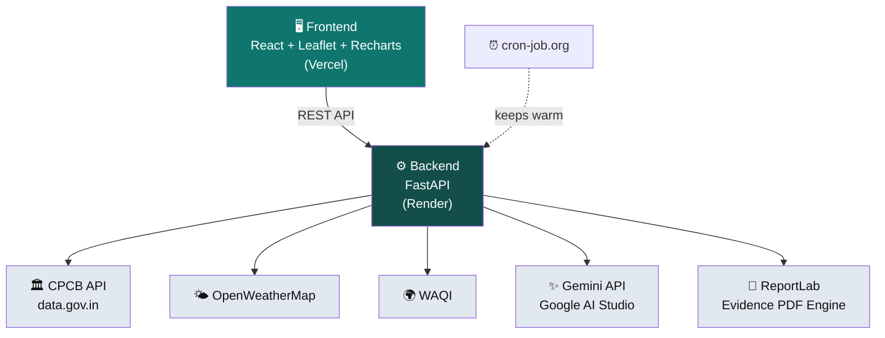

<div align="center">

# 🌬️ VAYU
### *Clean Air, Enforced.*

**An AI-powered air quality enforcement & citizen reporting platform, built on real government sensor data and real-time generative AI.**

[](https://vayu-airquality.vercel.app/)
[](https://vayu-airquality.onrender.com)
[]()


</div>

---

## 🧭 The 30-Second Pitch

India runs 900+ air quality monitors, yet most neighborhoods have **zero** real-time coverage. Complaints get filed, but inspections lag days behind. The data exists. The *intelligence layer to act on it* does not.

**VAYU is that layer.** Citizens report pollution with photo evidence and a precise map pin. A live Gemini model reads that evidence, attributes the likely source, scores its confidence, and hands the officer a ready-to-act, priority-ranked incident — with a downloadable evidence PDF generated in one click.

No mockups. No scripted demo data. Real CPCB sensors, real AI inference, live in production right now.

> 🔗 **Try it yourself:** [vayu-airquality.vercel.app](https://vayu-airquality.vercel.app/)

---

## 📚 Table of Contents

- [The Problem](#-the-problem)
- [What VAYU Does](#-what-vayu-does)
- [The Innovation — Hyperlocal Coverage from Sparse Sensors](#-the-innovation--hyperlocal-coverage-from-sparse-sensors)
- [Architecture](#️-architecture)
- [Tech Stack](#-tech-stack)
- [APIs & Credits](#-apis--credits)
- [Running It Locally](#-running-it-locally)
- [Project Structure](#-project-structure)
- [Roadmap](#-roadmap)
- [Team](#-team)

---

## 🚨 The Problem

| | |
|---|---|
| 🕐 **Official response target** | 24 hours from complaint to nodal-agency action |
| 🕑 **Real-world timeline** | 1–3 days, per citizen-facing enforcement guides |
| 📡 **Sensor coverage** | Chandigarh — our pilot city — has just **3** physical CAAQMS stations for the *entire* city |
| 🤖 **AI in the loop** | None. Existing complaint apps route text manually, with zero prioritization intelligence |

The gap isn't data. It's the missing layer that turns raw sensor readings and citizen photos into **prioritized, evidence-backed action.**

---

## ⚡ What VAYU Does

### 👤 For Citizens
- 🗺️ Live AQI map — real CPCB station data, computed with the **official government AQI formula**
- 📸 Guided reporting — draggable pin (mandatory), mandatory photo evidence, place-type classification
- 📋 **My Reports** — real-time status tracking, so reporting isn't shouting into a void
- 🔮 24-hour Predictive Analysis — for *any* sector, sensor or no sensor

### 🛡️ For Regulatory Officers
- 📊 Priority-ranked incident queue — worst cases surface first, automatically
- 🧠 **AI Review Panel** — Gemini reads the citizen's actual photo + description, live, and returns source attribution, confidence %, severity, and a recommended enforcement action
- 📄 **One-click Evidence Package** — a real, downloadable PDF with photo + AI analysis + officer notes, ready for formal filing
- 🎯 Source Attribution view — technical breakdown for officers, plain-language for citizens

---

## 🎯 The Innovation — Hyperlocal Coverage from Sparse Sensors

Three real sensors. A whole city's worth of estimates.

```
Sector 22 (real) ●───┐
                     │  Inverse-distance-weighted
Sector 25 (real) ●───┼──►  interpolation + live wind data
                     │
Sector 53 (real) ●───┘
                     ↓
        Sector 17, 34, 36... (estimated, clearly labeled)
```

Every estimated reading is **explicitly marked** as an estimate — never disguised as a live measurement. When a real sensor's individual pollutant channel stalls (a documented reality of India's monitoring hardware), VAYU reflects that honestly instead of quietly hiding it.

---

## 🏗️ Architecture



**Design principle:** the frontend never talks to any external API directly — everything routes through the backend, so credentials never touch the client and every AI call is auditable server-side.

---

## 🧰 Tech Stack

| Layer | Technology |
|---|---|
| **Frontend** | React (Vite), Tailwind CSS, Leaflet + React-Leaflet, Recharts, Lucide Icons |
| **Backend** | FastAPI (Python), Pydantic |
| **AI** | Google Gemini API — source attribution, incident analysis, forecast insight generation |
| **PDF Engine** | ReportLab — server-generated Evidence Packages |
| **Design** | Google Stitch (UI/UX prototyping) |
| **Dev Assistance** | Claude (Anthropic) — code generation, debugging, architecture |
| **Hosting** | Vercel (frontend) · Render (backend) |
| **Uptime** | cron-job.org — scheduled pings, zero cold-start on demo day |

---

## 🔑 APIs & Credits

VAYU runs entirely on **free-tier** services. Here's what powers it, and where to get your own keys if you fork this:

| Service | Purpose | Get a Key |
|---|---|---|
| **CPCB Real-Time AQI** | Live official pollutant readings | [data.gov.in — Real Time AQI Dataset](https://www.data.gov.in/resource/real-time-air-quality-index-various-locations) |
| **OpenWeatherMap** | Wind speed/direction, temperature | [openweathermap.org/api](https://openweathermap.org/api) → [API Keys dashboard](https://home.openweathermap.org/api_keys) |
| **WAQI** | Supplementary city-level AQI | [aqicn.org/data-platform/token](https://aqicn.org/data-platform/token/) |
| **Gemini API** | All AI inference | [Google AI Studio](https://aistudio.google.com/apikey) |

> ⚠️ **Security note:** Never commit real API keys to this repo. All keys live in `.env` files (gitignored) locally, and as encrypted environment variables on Vercel/Render in production.

---

## 💻 Running It Locally

**Backend**
```bash
cd backend
python -m venv .venv
.venv\Scripts\activate        # Windows
pip install -r requirements.txt

# create a .env file with:
# CPCB_API_KEY=your_key
# OWM_API_KEY=your_key
# WAQI_TOKEN=your_token
# GEMINI_API_KEY=your_key

uvicorn main:app --reload
```

**Frontend**
```bash
cd frontend
npm install

# create a .env file with:
# VITE_API_URL=http://127.0.0.1:8000

npm run dev
```

Visit `http://localhost:5173` — the app auto-detects local vs. deployed backend via `VITE_API_URL`.

---

## 📁 Project Structure

```
vayu-airquality/
├── backend/
│   ├── main.py              # FastAPI app — all routes, AI calls, AQI formula
│   └── requirements.txt
├── frontend/
│   └── src/
│       ├── components/
│       │   ├── DashboardShell.jsx      # Map, dropdowns, routing
│       │   ├── OfficerReportsTable.jsx
│       │   ├── AIReviewPanel.jsx       # Gemini-powered analysis + PDF trigger
│       │   ├── ReportIssueForm.jsx     # Citizen reporting w/ map pin + photo
│       │   ├── PredictiveAnalysis.jsx
│       │   ├── SourceAttribution.jsx
│       │   └── MyReportsTracker.jsx
│       └── config.js         # API base URL + retry logic
└── README.md
```

---

## 🗺️ Roadmap

- [x] Chandigarh pilot — 3 live CAAQMS stations + interpolated coverage
- [x] Full citizen → officer AI workflow, live in production
- [x] Evidence Package PDF generation
- [ ] RMSE-validated ML forecasting (currently heuristic-based)
- [ ] Multilingual citizen advisories (Hindi, Punjabi, regional languages)
- [ ] Multi-city expansion
- [ ] Satellite integration (Sentinel-5P) for geospatial source attribution

---

## 👥 Team — No.18

Built for **ET AI Hackathon 2026**, Problem Statement 5.

**Aryaman Khanna** — Team Lead
**Amberneal Singh** — Teammate

---

<div align="center">

### 🌱 *From reactive complaint boxes to live, AI-prioritized enforcement.*

**[Live App](https://vayu-airquality.vercel.app/) · [Report an Issue](https://github.com/Am-berneal/vayu-airquality/issues)**

</div>
